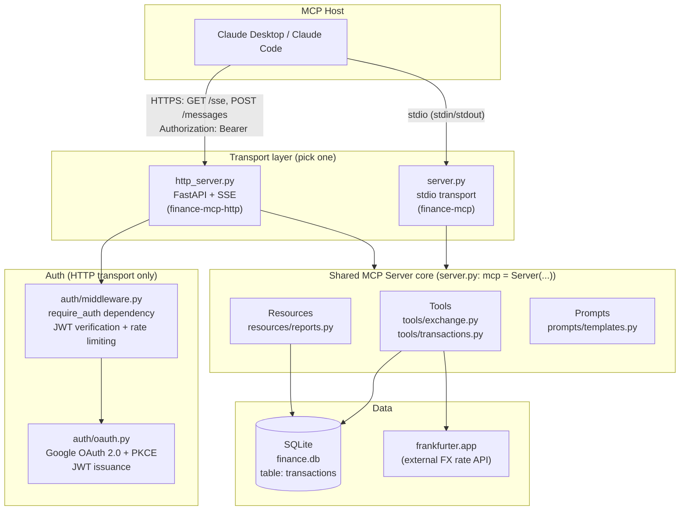
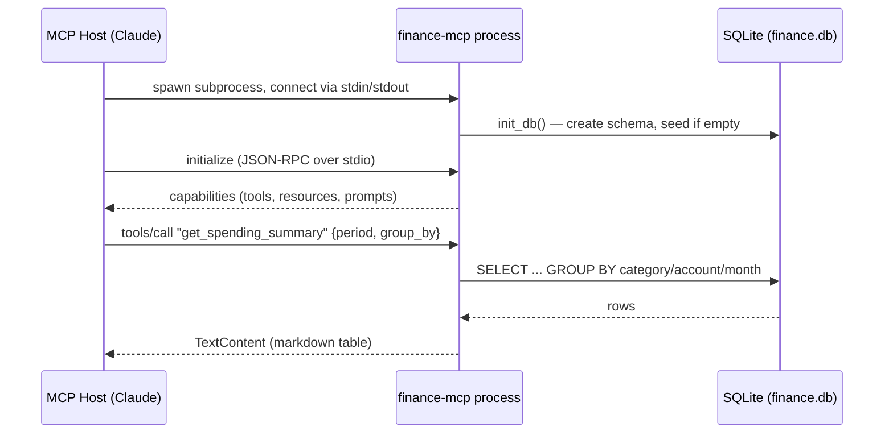
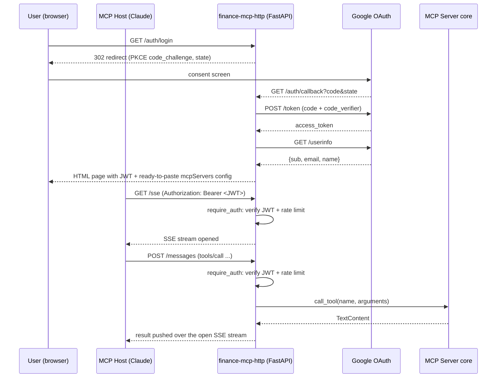
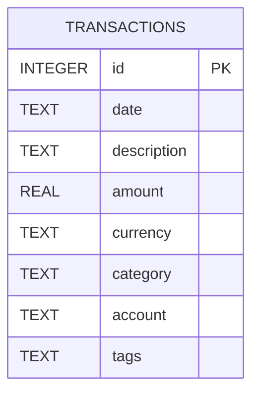

# Finance MCP Server

An [MCP](https://modelcontextprotocol.io) (Model Context Protocol) server that gives an LLM client (Claude Desktop, Claude Code, or any other MCP host) structured access to personal finance data: transaction search, spending summaries, monthly P&L reports, and live currency exchange rates.

Data lives in a local SQLite database that is auto-created and seeded with 6 months of synthetic sample transactions on first run — there is nothing to configure to start exploring it.

The server ships with **two interchangeable transports** built on the same underlying MCP `Server` instance:

| Entry point | Transport | Auth | Intended use |
|---|---|---|---|
| `finance-mcp` | stdio | none | Local use from Claude Desktop / Claude Code |
| `finance-mcp-http` | HTTP + SSE | Google OAuth 2.0 (PKCE) + JWT | Remote/multi-user access over the network |

## What it exposes

### Tools (callable actions)

| Tool | Module | Description |
|---|---|---|
| `search_transactions` | `tools/transactions.py` | Filter transactions by text, date range, category, amount range, account. Returns a markdown table. |
| `get_spending_summary` | `tools/transactions.py` | Aggregate spending by category / account / month over a period (7d/30d/90d/this month/last month). |
| `get_exchange_rate` | `tools/exchange.py` | Current or historical FX rates via [frankfurter.app](https://frankfurter.app), cached in-memory for 1 hour. |
| `convert_amount` | `tools/exchange.py` | Convert an amount between two currencies using live rates. |

Adding a new domain of tools only requires creating a module that exports a `TOOLS: list[ToolRegistration]` and listing it in `_TOOL_MODULES` in [server.py](src/finance_mcp/server.py) — `list_tools`/`call_tool` never need to change.

### Resources (read-only documents)

| URI | Description |
|---|---|
| `finance://transactions/recent` | Last 30 days of transactions as markdown |
| `finance://reports/monthly/latest` | Current month's income/expense/net P&L report |

### Prompts (reusable analysis workflows)

| Prompt | Purpose |
|---|---|
| `analyze_spending` | Category breakdown + top expenses + savings recommendations for a period |
| `budget_review` | Actual spend vs a stated monthly budget, with an end-of-month projection |
| `currency_exposure` | Foreign-currency exposure across accounts and FX risk sensitivity |

## Architecture



**Key design point:** `http_server.py` imports the *same* `mcp` `Server` instance from `server.py` (`from finance_mcp.server import mcp`) — tool/resource/prompt logic is defined exactly once and is transport-agnostic. The HTTP server just wraps it with FastAPI routes, OAuth, and an SSE pipe instead of stdio pipes.

## Request flow — stdio (Claude Desktop / Claude Code)

No authentication: the host spawns the server as a subprocess and trusts it implicitly (same machine, same user).



## Request flow — HTTP/SSE (remote, OAuth-protected)



JWTs are short-lived (`JWT_EXPIRE_MINUTES`, default 60 min) and every request — both `/sse` and `/messages` — is independently verified and rate-limited (`RATE_LIMIT_PER_MINUTE`, default 60 req/min, sliding 60s window).

## Data model



Single table, created and seeded automatically by [`db/setup.py`](src/finance_mcp/db/setup.py) on first run of either entry point (`init_db()`). `amount` is negative for expenses, positive for income. `category` for seeded data: `Food`, `Transport`, `Entertainment`, `Utilities`, `Shopping`, `Healthcare`, `Salary`, `Freelance`. `account`: `main` (PLN) or `usd-account` (USD).

## Project structure

```
src/finance_mcp/
├── server.py              # stdio entry point; defines the shared `mcp` Server + tool/resource/prompt registry
├── http_server.py          # FastAPI + SSE entry point; OAuth routes, reuses `mcp` from server.py
├── config.py                # pydantic-settings Settings, loaded from .env
├── db/
│   └── setup.py             # schema + synthetic seed data generator
├── auth/
│   ├── oauth.py              # Google OAuth 2.0 PKCE flow + JWT issuance/verification
│   └── middleware.py         # require_auth FastAPI dependency (JWT check + rate limiting)
├── tools/
│   ├── __init__.py           # ToolRegistration/ToolHandler type aliases
│   ├── transactions.py       # search_transactions, get_spending_summary
│   └── exchange.py           # get_exchange_rate, convert_amount (frankfurter.app, TTL cache)
├── resources/
│   └── reports.py            # recent transactions + monthly report markdown builders
└── prompts/
    └── templates.py          # analyze_spending, budget_review, currency_exposure prompt templates
```

## Setup

Requires Python ≥3.12.

```bash
# create a virtualenv and install in editable mode
uv venv --python 3.12 .venv
uv pip install -e . --python .venv/bin/python

# configure (optional — sensible defaults exist for everything except OAuth)
cp .env.example .env
```

> **Note:** `mcp` is pinned to `<2.0.0` in `pyproject.toml`. The `mcp` 2.x release changed the `Server` API (removed the `@server.list_tools()`/`@server.call_tool()` decorators this codebase uses), so installing an unpinned `mcp` breaks the server at startup.

### Run via stdio (local, no auth)

```bash
.venv/bin/finance-mcp
```

### Run via HTTP/SSE (remote, OAuth-protected)

Requires `OAUTH_CLIENT_ID` / `OAUTH_CLIENT_SECRET` from a Google Cloud Console OAuth client, and a real `JWT_SECRET` (`openssl rand -hex 32`) before exposing it beyond localhost.

```bash
.venv/bin/finance-mcp-http
# → visit http://localhost:8000/auth/login to authenticate and get a ready-to-use mcpServers config snippet
```

## Adding to Claude Code

```bash
claude mcp add finance-mcp -- /absolute/path/to/.venv/bin/finance-mcp
```

This registers a stdio server under the `local` scope (tied to the project directory you run the command from). **The MCP server list is loaded once at session start** — restart Claude Code (or open a new session) to see `finance-mcp` and its tools under `/mcp`. Verify the registration independently at any time with:

```bash
claude mcp list
```

## Adding to Claude Desktop

Add to `claude_desktop_config.json`:

```json
{
  "mcpServers": {
    "finance": {
      "command": "/absolute/path/to/.venv/bin/finance-mcp"
    }
  }
}
```

For the HTTP/SSE variant, use the `mcpServers` snippet rendered automatically on the `/auth/callback` page after logging in.

## Tests

```bash
uv pip install -e ".[dev]" --python .venv/bin/python
.venv/bin/pytest
```
